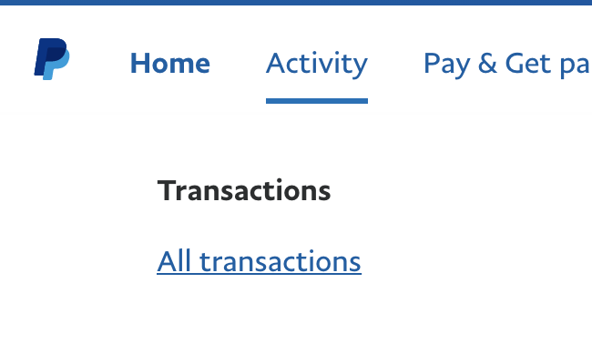
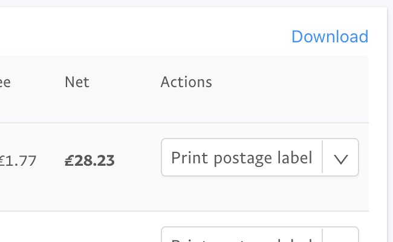
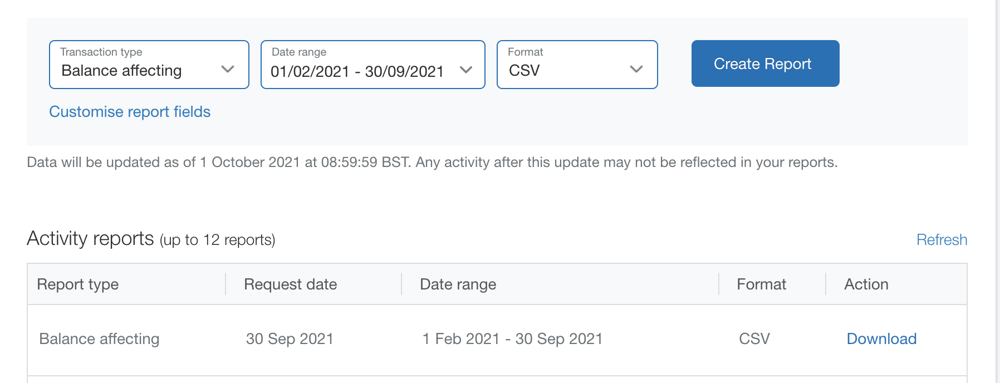
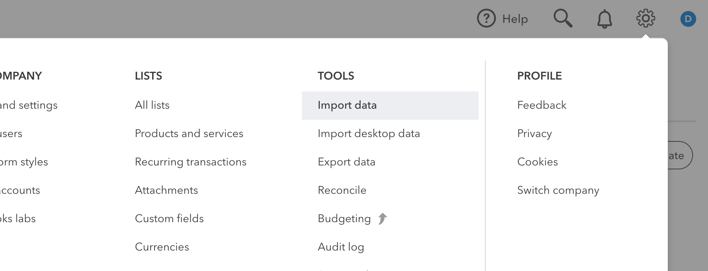

# IMEXHUB
Our goal is to support businesses and charities that lack the technical resources to work with multiple sources of data efficiently. Without us they either struggle with a manual, repetitive process, or use a third party software vendor and pay transaction based subscription fees. We offer either a one-off implementation cost, or a free “do it yourself” option.


## WHO’S IT FOR?
- Organisations looking to automate the inefficient repetitive work necessary to bridge the gap between systems

- Professionals wanting to learn/retrain, while solving real life problems with the structure and support to create, showcase and scale their solution


## WHY OPEN SOURCE?
- Common features required across data connection/transformation projects make solutions that were previously uneconomical to develop from scratch (for charities/SMEs) more likely to be created

- Wide variety of input and output systems with a need for connection, such as invoices/apps/reports/document management systems


## WHAT CAN IMEXHUB DO?
We're excited that the first iteration of IMEXHUB is already helping two organisations with their business admin processes:

- A CHARITY uses IMEXHUB to build custom reports for a self-managed invoicing process
    - MONTHLY REPORTS PROCESSED SINCE AUGUST 2020 - Less customer questions for improved satisfaction ratings
    - 100+ HOURS SAVED ACROSS 3 TEAMS (PER REPORT) - High employee and volunteer morale working with accurate data
    - 2,000+ LINES OF DATA PROCESSED IN 12 SECONDS - Increased funds with reliable account management

- STATEMENTREADER (our sibling product) uses IMEXHUB to convert multi currency PayPal CSV data into Quickbooks
    - LOCAL DATA PROCESSING - No third party API authorisation required, no loss of your customer data, no data limits
    - USER STAYS IN CONTROL - See the transactions in Excel before uploading to Quickbooks
    - FREE - Completely:) The closest comparison product costs £hundreds each year to process more than 100 transactions per month


## WHAT DOES IMEXHUB LOOK LIKE?

<em>Screenshot of main interface</em>


## GETTING STARTED
### FOR CLIENTS
Here's the link to download the Windows installer: https://drive.google.com/file/d/1hPteMyU6Oni7YIvZy-OY_BORta6dVv5r/view?usp=sharing

Download, install and run IMEXHUB.  For multi currency PayPal to QBO follow these steps:

1. Locate the 'All transactions' view from PayPal


2. Click to enter the 'Download' section of PayPal


3. Create and download a report of 'balance affecting' transactions for the desired period, in a CSV format


4. Import the downloaded CSV file to IMEXHUB

5. Click to Export a zip file containing separate CSV files

*CHECK THE CSV FILES: you can change the VAT rate and Item easily at this stage in Excel, then save your changes in a CSV format*

6. Import the CSV files from IMEXHUB to the correct sections of QBO as follows (these files may change depending on the currencies you have transactions for):<br>
USD.csv -> Bank Data<br>
GBP.csv -> Bank Data<br>
EUR.csv -> Bank Data<br>
QBsalesreceipts.csv -> Sales Receipts<br>
QBexpenses_QBexpenses_paypal.csv -> Bills


7. Check and edit any transactions that need extra attention in QBO.  Report back any issues to help other users.


### FOR DEVELOPERS
IMEXHUB is a lightweight data manipulation tool; here's some notes to get you started with learning from/contributing to the code:
- Install R and RStudio
- No external database is required, a local json file is used for simplicity
- config.yaml currently provides Dropbox credentials only, a copy of .config.yaml is still needed
- The following libraries are required:
```
install.packages(c("shiny", "shinyWidgets", "shinythemes", "shinyFiles", "shinyjs", "config", "tidyverse", "lubridate", "readxl", "openxlsx", "DT", "mongolite", "jsonlite", "RSQLite", "cachem"))
```


## WHAT'S NEXT?
PRIORITY TASKS:

- Cards, for separate input and export configurations: The main interface currently has a single import and export section (a ‘card’); this needs to be modularised for the user to set up multiple cards. For example an import type could be ‘Dropbox’, then the user can refresh the import to see the files and click export.

- Add Renderui to reset fileInput on import file: this will allow multiple files to be uploaded with the progress bar showing correctly each time.

OTHER TASKS:

- Sessions, for concurrent users
- Email (input)
- PDF QR code (input)
- Duplicate transactions (process)
- PDF text parser (input)
- Schedule imports
- Schedule exports
- Document history log
- User settings window
- Display whether import is already exported in overview table
- SEO analysis for feature list and homepage optimisation


## GET IN TOUCH
Email us at david@statementreader.com or connect here: https://www.linkedin.com/in/delms/
